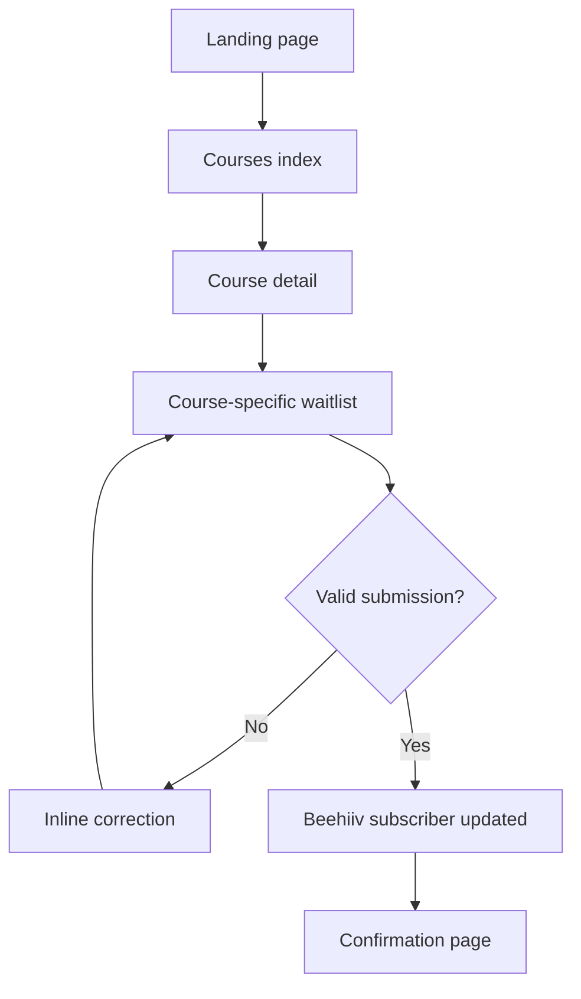
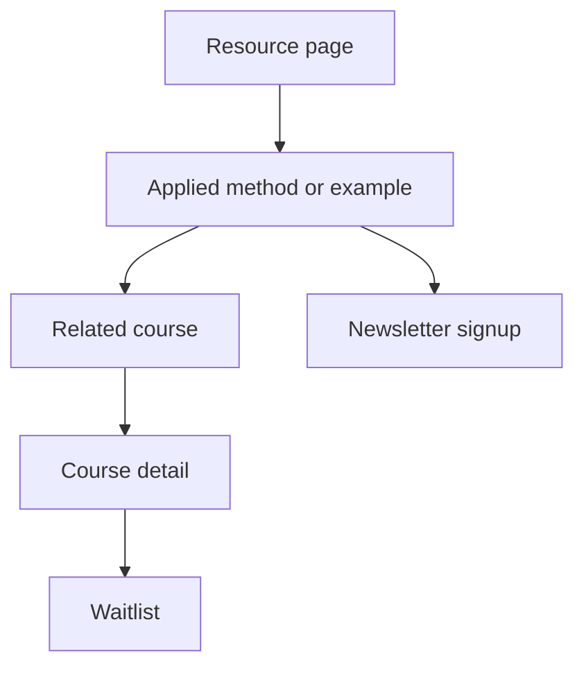
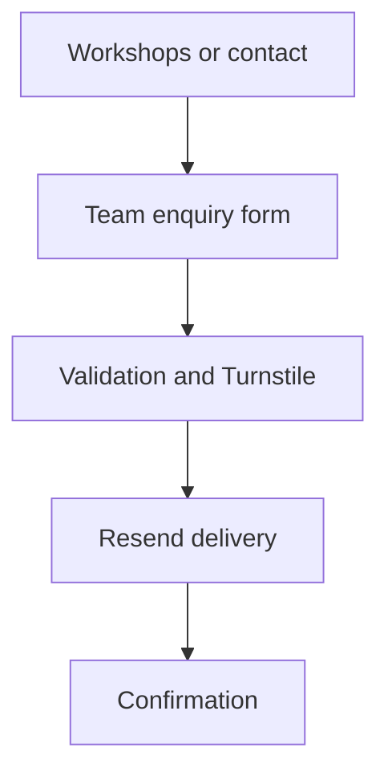
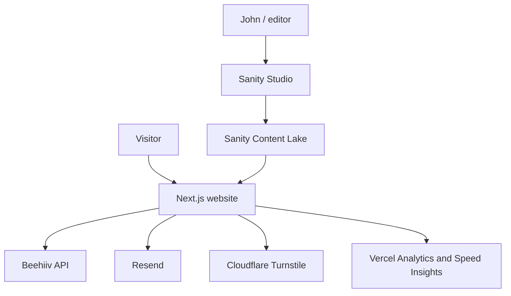

# Switch to UX Website Redesign PRD

**Product:** Switch to UX 2.0  
**Domain:** switchtoux.com  
**Document type:** Product Requirements Document  
**Status:** Ready for implementation  
**Owner:** John Iseghohi  
**Implementation:** Codex  
**Last updated:** 1 September 2026  
**Companion build specification:** `switchtoux-redesign-codex-prompt.md`
**Companion visual specification:** `switchtoux-DESIGN.md`

The visual specification is the source of truth for colours, typography, layout, component geometry, responsive composition, motion and atmospheric effects. Where older visual notes in this PRD or build prompt conflict with `switchtoux-DESIGN.md`, the visual specification wins.

---

## 1. Executive summary

Switch to UX is being repositioned from a conventional UX career-switching platform into a practical school for AI-native product designers.

The existing website has begun using AI-focused positioning, but the underlying experience still reflects an older bootcamp model. The course structure centres on design thinking, Figma, wireframes, usability testing, portfolio preparation and job search. These skills remain useful, but they no longer represent the full capability expected from a modern product designer.

The redesigned site will present a new educational system focused on four connected capabilities:

1. Making grounded product decisions.
2. Designing intelligent and agentic product behaviour.
3. Building working prototypes with AI-assisted development tools.
4. Evaluating usability, model behaviour, failure and trust.

The first release is a credibility and demand-generation website. All courses and workshops will launch in a transparent **Coming soon** state. The website will collect qualified course interest, grow the Design With AI newsletter and support enquiries for team workshops.

The release will not include payments, student accounts, an LMS, lesson delivery or fake enrolment dates. Those capabilities will be added only when the first course is ready to sell.

## 2. Product vision

### Vision statement

Build the most practical and credible destination for designers who want to learn how to make product decisions, design AI behaviour, build working systems and prove those systems deserve to exist.

### Brand position

> The practical school for AI-native product designers.

### Core message

> Design with judgment. Build with AI. Ship proof.

### Product promise

Switch to UX helps product designers and serious career switchers learn how to research, design, build and evaluate intelligent products. Learners move beyond static screens and leave with working artefacts that demonstrate how they think.

## 3. Background and problem

### Current-state problems

The current website creates several product and trust issues:

- The homepage promises AI-enhanced design education, but much of the visible curriculum remains a traditional UX bootcamp.
- Old pages still reference 2024 dates and John's previous Amazon position.
- Some sections contain template content, placeholder testimonials and unrelated Quillow contact information.
- The information architecture mixes courses, workshops, newsletter content, mentorship and coming-soon products without a clear priority.
- The site does not clearly distinguish learning to use AI tools from learning to design AI products.
- Course availability is inconsistent and some calls to action lead to products that are not ready.
- Content focuses heavily on AI predictions and tool lists, which age quickly and do not demonstrate a defensible teaching method.
- Course and workshop content is not managed through a structured editorial system.
- There is no reliable way to segment interest by course or understand what potential students want to learn.

### Market change

AI has reduced the effort required to produce interface variations, content and functional prototypes. This raises the relative importance of product judgment, evidence, interaction logic, system behaviour, evaluation and communication.

Switch to UX must teach and demonstrate this broader role. The website itself should model that standard through strong content architecture, clear programme states, transparent claims, credible interaction design and production-quality implementation.

### Opportunity

John has an unusually strong combination of experience:

- More than 13 years in product design.
- Current Staff Product Designer experience on AI Agent Studio at Algolia.
- Previous product work at Amazon, Booking.com, Etisalat, Konga and eTranzact.
- UX teaching and workshop facilitation experience.
- Practical experience with Figma, Codex, Cursor, repositories, APIs and AI product prototyping.
- An emerging signature method around Grounded Design: Evidence, Inference, Assumption and Unknown.

The site should make this combination visible and convert it into a focused educational offer.

## 4. Goals

### Primary goals

1. Reposition Switch to UX as an AI-native product design school.
2. Establish John as a credible practitioner-instructor in AI product and agent design.
3. Explain the course portfolio clearly before enrolment opens.
4. Collect qualified, programme-specific waitlist interest.
5. Grow the Design With AI newsletter.
6. Generate private workshop and team-training enquiries.
7. Create an editorial system that John can update without editing code.
8. Preserve the useful search equity and URLs of the existing website.

### Secondary goals

1. Create a reusable design and content system for future course launches.
2. Make course availability manageable from the CMS.
3. Create a resource hub that compounds through durable methods and practical artefacts.
4. Capture analytics that can guide the order in which courses are produced.
5. Prepare the architecture for later payments, cohorts and learning delivery without building them prematurely.

## 5. Non-goals for release one

The following are explicitly out of scope:

- Selling courses or collecting payment.
- Stripe integration.
- Student accounts or authentication.
- An LMS, lesson player, progress tracking or certificates.
- Community forums or member chat.
- Automated cohort scheduling.
- Workshop ticketing.
- Course completion records.
- A public student directory.
- A large searchable tool directory.
- Personalised course recommendations driven by AI.
- A general-purpose page builder inside the CMS.
- Migration of every low-value legacy page.
- A mobile application.

The architecture may leave clean integration points for future phases, but Codex must not implement these features in the first release.

## 6. Success measures

The launch should be measured as a demand-validation product, not only a website redesign.

### Primary metrics

- Number of qualified course waitlist submissions.
- Waitlist conversion rate by course page.
- Percentage of submissions that identify a specific course.
- Workshop-interest registrations by workshop topic.
- Design With AI newsletter subscriptions.
- Team-training enquiries.
- Waitlist form completion rate.

### Behaviour metrics

- Homepage to Courses click-through rate.
- Courses index to course-detail click-through rate.
- Course-detail to waitlist-start rate.
- Waitlist-start to waitlist-submit rate.
- Resource to course or newsletter conversion.
- Returning visitor rate after resource publication begins.

### Quality metrics

- No critical accessibility violations in automated scans.
- No broken internal links at launch.
- No false form-success states.
- Good Core Web Vitals at the 75th percentile once sufficient traffic exists.
- Lighthouse target of at least 90 for Performance and 95 for Accessibility on representative pages.
- All indexed legacy priority URLs either preserved or redirected permanently.

### Initial conversion hypotheses

Because the current site does not provide a reliable baseline, the following are planning hypotheses, not promises:

- 15% or more of course-detail visitors start the waitlist form.
- 60% or more of users who start the waitlist form complete it.
- 5% or more of resource readers subscribe to Design With AI or visit a related course.

Review these figures after the first 500 qualified sessions and replace them with observed baselines.

## 7. Audience and personas

### Persona A: The working product designer

**Priority:** Primary

**Profile:** A UX or product designer with 2-8 years of experience. Comfortable in Figma, familiar with research and product delivery, but uncertain about AI-native workflows.

**Needs:**

- A practical map of where AI belongs in design work.
- Confidence building working prototypes.
- Understanding of AI interaction patterns and failure states.
- A credible portfolio project that is more than an AI-generated interface.
- Language for explaining their product judgment.

**Barriers:**

- Tool overload.
- Fear of code and repositories.
- Generic prompting courses that lack product depth.
- Limited time outside work.
- Concern that their existing skills are becoming less valuable.

### Persona B: The senior designer moving into AI products

**Priority:** Primary

**Profile:** A senior, staff or lead designer joining an AI team or being asked to lead agentic product work.

**Needs:**

- Practical agent UX frameworks.
- Ways to handle uncertainty, permissions, trust, memory and autonomy.
- Evaluation methods that connect product quality and model quality.
- Peer discussion grounded in real product constraints.

**Barriers:**

- Many available courses remain introductory or tool-centred.
- AI engineering terminology can obscure the product decision.
- Few examples address enterprise workflows and complex systems.

### Persona C: The serious career switcher

**Priority:** Secondary

**Profile:** A professional entering product design who wants a current learning path rather than a 2020-era bootcamp curriculum.

**Needs:**

- Durable UX and product design foundations.
- Guidance using AI without outsourcing judgment.
- A working project and evidence-led case study.
- A clear learning sequence and feedback.

**Barriers:**

- A difficult entry-level design market.
- Confusing differences between UX, UI, product design and AI product design.
- Too many courses that optimise for completion rather than employable proof.

### Persona D: The design or product leader

**Priority:** Third

**Profile:** A design manager, product leader or innovation lead seeking practical training for a team.

**Needs:**

- A shared AI-native design workflow.
- Workshops connected to current product challenges.
- Responsible use of customer and research data.
- Repeatable opportunity, prototyping and evaluation methods.

## 8. Jobs to be done

### Visitor jobs

- When I feel behind on AI, help me understand which design capabilities I actually need so I can invest my time wisely.
- When I evaluate a course, show me the work I will produce and the decisions I will learn to make so I can judge whether it is credible.
- When a course is not yet available, let me register for that specific programme without pretending enrolment is open.
- When I am unsure which programme fits, help me compare audience, level, format and outcome.
- When I read a useful resource, help me continue through a related course, workshop or newsletter.
- When I am responsible for a design team, let me enquire about a private workshop with enough context for a useful response.

### Admin jobs

- When a programme changes, let me update its status, copy, modules and SEO without changing code.
- When I publish a resource, let me preview it accurately before it goes live.
- When people join a waitlist, let me segment them by programme, role and experience.
- When a course opens, let me change every relevant badge and CTA from one source of truth.
- When an old page is retired, let me add a redirect without creating broken links.

## 9. Product principles

### 9.1 Transparent availability

Every programme is Coming soon until a real date, format and price exist. The website must never imply that a visitor can purchase an unavailable course.

### 9.2 Evidence before hype

The site should demonstrate John's experience and teaching method without inventing testimonials, metrics or hiring outcomes.

### 9.3 Outputs before syllabus volume

Course pages should lead with what learners will create and how those artefacts demonstrate judgment.

### 9.4 One source of truth

Course status, course copy, modules, FAQs and relationships must come from the CMS. The same status must drive cards, detail pages, CTAs and metadata.

### 9.5 Build for editorial independence

John should be able to manage content through a visual CMS, but layout, interaction and design-system decisions should stay in code.

### 9.6 Accessible by default

Accessibility is part of the product definition, not a post-launch audit.

### 9.7 Minimise operational overhead

Release one should use managed services and avoid a separate application database where an existing newsletter platform can reliably store and segment course interest.

## 10. Information architecture

### Primary navigation

- Courses
- Workshops
- Resources
- About
- Newsletter
- Join the waitlist

### Required routes

| Route | Purpose | Primary action |
| --- | --- | --- |
| `/` | Position the school and route visitors | Explore courses / join waitlist |
| `/courses` | Compare all programmes | View course |
| `/courses/ai-native-product-designer` | Flagship programme detail | Join course waitlist |
| `/courses/designing-agentic-experiences` | Specialist course detail | Join course waitlist |
| `/courses/building-working-prototypes-with-ai` | Specialist course detail | Join course waitlist |
| `/courses/grounded-research-with-ai` | Specialist course detail | Join course waitlist |
| `/courses/ai-evals-for-product-designers` | Specialist course detail | Join course waitlist |
| `/courses/ai-native-product-design-foundations` | Career-switcher programme | Join course waitlist |
| `/workshops` | Show live practical sessions | Register interest |
| `/resources` | Browse articles, guides and templates | Read / subscribe |
| `/resources/[slug]` | Consume a resource | Related course / newsletter |
| `/newsletter` | Explain Design With AI | Subscribe |
| `/about` | Establish founder credibility | Explore courses |
| `/contact` | General and team enquiries | Send enquiry |
| `/waitlist` | Capture programme-specific interest | Submit waitlist form |
| `/thank-you` | Confirm successful submission | Read resources / subscribe |
| `/privacy` | Explain data use | None |
| `/terms` | Explain site terms | None |
| `/studio` | Authenticated Sanity Studio | Manage content |

### Legacy routing

Minimum permanent redirects:

- `/ux-design-bootcamp` to `/courses/ai-native-product-design-foundations`
- `/about-john-iseghohi` to `/about`
- Existing blog slugs should be preserved or redirected to corresponding resource slugs.
- Existing `/workshops` and `/contact` routes remain canonical.

Codex must crawl or inspect the current site's known routes before cutover and create a complete redirect map.

## 11. Core user journeys

### Journey A: Course discovery and waitlist



Requirements:

- The selected course must persist from CTA to submission.
- The user may change the selected programme before submitting.
- Existing subscribers must be updated rather than duplicated.
- Success appears only after Beehiiv accepts the request.
- If the provider is unavailable, preserve the form data and show a useful retry state.

### Journey B: Resource to programme



### Journey C: Team training enquiry



## 12. Programme portfolio

All programmes launch with `coming-soon` status.

### Flagship programme

**AI-Native Product Designer**  
Six-week planned cohort for designers with foundational experience. Learners frame an AI opportunity, design intelligent behaviour, build a working prototype, evaluate it and create a portfolio case study.

### Specialist courses

1. **Designing Agentic Experiences**
2. **Building Working Prototypes With AI**
3. **Grounded Research With AI**
4. **AI Evals for Product Designers**

### Foundation course

**AI-Native Product Design Foundations**  
An eight-week planned path for beginners and career switchers.

### Workshops

1. Build an AI Product Prototype
2. Design an Agent Users Can Trust
3. AI Research Without False Confidence
4. Write Your First Product Eval
5. Figma to Working Product
6. Build Your AI-Native Portfolio Case Study

The detailed page copy, module lists and planned outputs are defined in the companion build specification.

## 13. Functional requirements

### FR-01: Global navigation

The website must provide a consistent desktop and mobile navigation system.

**Acceptance criteria:**

- The current route is distinguishable.
- All navigation elements work with keyboard and touch.
- Mobile navigation traps focus appropriately while open.
- Body scrolling is disabled behind the open mobile menu.
- Escape closes the mobile menu.
- The primary waitlist CTA is visible without overwhelming the navigation.

### FR-02: Homepage

The homepage must communicate the new position, establish credibility, explain the educational method and route visitors to courses, workshops, resources and newsletter signup.

Required sections:

- Announcement strip
- Hero
- Credibility bar
- Explanation of the changing design role
- Grounded Design method
- Featured programme and specialist courses
- Learning model
- Course artefacts
- Audience groups
- Workshops
- Instructor
- Newsletter
- Final waitlist CTA

### FR-03: Courses index

The Courses page must help visitors compare programmes.

**Acceptance criteria:**

- Courses are grouped as flagship, specialist and foundation.
- Each card displays title, short promise, level, planned format and status.
- Desktop may use a comparison table.
- Mobile must provide a readable stacked comparison rather than horizontal overflow.
- Filters are not required for six courses.
- Course status comes from Sanity.

### FR-04: Course detail pages

Course pages must render from one reusable template and structured CMS content.

Required content:

- Breadcrumbs
- Coming soon badge
- Title and outcome-led headline
- Audience and level
- Planned format
- Development-status notice
- Outputs
- Modules
- Tools and methods
- Inclusions
- Instructor
- FAQs
- Related programmes
- Waitlist CTA

**Acceptance criteria:**

- Each CTA links to `/waitlist?interest={course-slug}`.
- No course displays price, start date or enrolment action unless the programme status changes and valid data exists.
- A course may not move to `enrolling` without price or external enrolment URL validation.

### FR-05: Programme status system

Supported status values:

```ts
type ProgrammeStatus =
  | "coming-soon"
  | "waitlist-open"
  | "enrolling"
  | "in-progress"
  | "closed";
```

The status determines:

- Badge text
- Primary CTA label
- Primary CTA destination
- Whether dates and price are visible
- Whether the page is eligible for Course Offer structured data
- Whether a course appears in Coming soon collections

Status behaviour:

| Status | CTA | Required data |
| --- | --- | --- |
| Coming soon | Join course waitlist | Course slug |
| Waitlist open | Join course waitlist | Course slug |
| Enrolling | View enrolment | Price, date and secure enrolment URL |
| In progress | Join the next cohort list | Course slug |
| Closed | Explore related courses | Related course or courses index |

### FR-06: Workshops

The Workshops page must display all planned live sessions, intended outcomes and proposed durations.

**Acceptance criteria:**

- Every workshop initially displays Coming soon.
- Each interest CTA passes the correct workshop slug.
- A team-training section routes to `/contact?type=team-training`.
- No fake dates or countdowns appear.

### FR-07: Resources

The Resources page must support five editorial categories:

- Grounded Design
- AI-Native Craft
- Designers Who Build
- Evaluation and Product Judgment
- Career Proof

Resource types:

- Essay
- Guide
- Template
- Teardown
- Workflow comparison
- Pattern guide

Resource status:

- Draft
- Coming soon
- Published
- Archived

**Acceptance criteria:**

- Published resources have a body, author, publication date, reading time and metadata.
- Coming soon resources show a description and subscription CTA, not an empty article.
- Archived resources are excluded from the index and sitemap but may remain addressable for redirects.
- Related resources and related courses are manually curated in Sanity.

### FR-08: Newsletter signup

Newsletter signups must create or update a subscriber in Beehiiv.

Required data:

- Email
- First name when provided
- Source page
- Newsletter consent timestamp
- Design With AI subscription intent

**Acceptance criteria:**

- API credentials remain server-side.
- Duplicate subscribers are handled safely.
- The API response is checked before showing success.
- Beehiiv custom fields are created in advance because unknown fields are discarded by the subscription API.
- The user can unsubscribe through Beehiiv emails.

### FR-09: Waitlist

Fields:

- First name
- Email
- Current role
- Experience level
- Learning goal
- Selected programme
- Optional newsletter consent

Experience values:

- Exploring product design
- Career switcher
- 0-2 years
- 3-5 years
- 6-9 years
- 10+ years
- Design or product leader

Beehiiv custom fields:

- `first_name`
- `switchtoux_role`
- `switchtoux_experience`
- `switchtoux_interest`
- `switchtoux_learning_goal`
- `switchtoux_source`
- `switchtoux_waitlist_joined_at`

Use a normalised interest slug rather than free text for programme selection.

**Acceptance criteria:**

- Client and server validation use the same Zod schema.
- The course or workshop interest is populated from the query string.
- The user may change the interest selection.
- Invalid interest values fall back to `all-courses` and are not trusted.
- Input survives a provider or network failure.
- The form prevents rapid repeat submissions.
- Free-text answers are never sent to analytics.
- The server must not log the complete form payload.

### FR-10: Contact and team enquiries

Fields:

- Name
- Work email
- Company, optional
- Enquiry type
- Message

Enquiry types:

- Course question
- Team training
- Speaking or workshop invitation
- Partnership
- Other

**Acceptance criteria:**

- Enquiries are sent to `hello@switchtoux.com` through Resend.
- The sending domain must be verified before production launch.
- The sender receives a concise confirmation only after successful delivery.
- The message is escaped and rendered safely.
- Enquiry details are not stored in Sanity.
- Failed delivery keeps the form populated and provides a mailto fallback.

### FR-11: Sanity Studio

Sanity Studio must be available to authenticated editors at `/studio`.

**Acceptance criteria:**

- Studio routes are excluded from public indexing.
- Draft content is not exposed publicly.
- Preview mode requires authentication.
- Visual editing links page content to its source fields where practical.
- Publishing a programme or resource triggers cache revalidation.

### FR-12: Redirect management

Redirects should be kept in code for critical permanent migrations and may also be stored in Sanity for later editorial maintenance.

**Acceptance criteria:**

- Redirect loops are rejected.
- Source paths must begin with `/`.
- Destination paths may be internal or verified external URLs.
- Permanent migrations use HTTP 308 or the hosting platform's permanent redirect mechanism.

### FR-13: Search and discovery

Site-wide search is not required at launch. The Resources page must support category filtering once at least ten published resources exist. Before that threshold, display editorial groupings without a search box.

### FR-14: Error and empty states

Create explicit states for:

- No published resources
- Coming soon content
- Form validation failure
- Provider failure
- Offline or interrupted submission
- Invalid resource slug
- Invalid course slug
- 404
- CMS unavailable

The public site should degrade to cached content if Sanity is temporarily unavailable.

## 14. Content requirements

### Content source of truth

The companion build specification contains the approved launch copy and should seed Sanity.

### Copy rules

- No lorem ipsum.
- No outdated Amazon role description.
- No Quillow details.
- No fake phone numbers or addresses.
- No fabricated testimonials.
- No unverifiable hiring claims.
- No tool-hype language.
- No published course date or price until confirmed.
- Planned formats must be labelled as planned while programmes are in development.

### Founder facts that may be used

- John Iseghohi is a Staff Product Designer working on AI Agent Studio at Algolia.
- He has more than 13 years of product design experience.
- He has worked at Algolia, Amazon, Booking.com, Etisalat, Konga and eTranzact.
- He has taught more than 200 designers.
- He has UX instructor and workshop facilitation experience.

### Tone

The tone must be practical, direct, intelligent, concise, constructive and evidence-led. It should sound like an experienced product designer teaching peers, not a generic bootcamp or AI productivity influencer.

## 15. Visual and interaction requirements

### Visual direction

The product should feel like a modern product lab and editorial design school.

Palette direction:

- Black page canvas
- Zinc surfaces and borders
- White and zinc text
- Rose `#F43F5E` primary accent
- Dark-only presentation in release one

Typography direction:

- Inter for display and body copy
- JetBrains Mono for labels, metadata and Grounded Design notation

The complete token definitions, page compositions, ecosystem hero, WebGL and canvas rules, responsive transformations and component specifications are defined in `switchtoux-DESIGN.md`.

Typography:

- Strong editorial display hierarchy
- Highly legible sans-serif body face
- Open-source fonts loaded through the framework's optimised font system
- Responsive type scale using CSS `clamp()` where appropriate

Visual language:

- `[E] Evidence`
- `[I] Inference`
- `[A] Assumption`
- `[X] Unknown`
- Product-state diagrams
- Prototype artefacts
- Evaluation scorecards
- Structured annotations
- Fine borders and visible grid logic

Avoid:

- Purple neon AI gradients
- Robot or glowing-brain imagery
- Random stock people
- Excessive glassmorphism
- Decorative motion without meaning
- Repetitive SaaS card grids
- Excessive pill-shaped UI

### Responsive behaviour

Design and test at 320, 375, 768, 1024 and 1440 pixels.

Key requirements:

- No horizontal overflow at 320 pixels.
- Comparison tables transform into labelled stacked groups on mobile.
- Sticky CTAs must not cover content or browser controls.
- Touch targets should be at least 44 by 44 pixels where practical.
- Course output lists and modules must remain scannable on small screens.

### Motion

- Use subtle transitions for disclosure, state change and navigation.
- Respect `prefers-reduced-motion`.
- Avoid autoplay media and scroll-jacking.
- No heavy animation dependency unless a specific interaction requires it.

## 16. Accessibility requirements

Target WCAG 2.2 AA.

Requirements:

- Semantic landmarks and logical heading order.
- Skip-to-content link.
- Full keyboard operation.
- Visible focus states.
- Accessible mobile navigation.
- Labels for every form control.
- Errors associated with fields and announced through an ARIA live region.
- Status badges do not rely on colour alone.
- Sufficient contrast for text, borders and focus indicators.
- Meaningful alternative text for informational media.
- Decorative media uses empty alternative text.
- Accordions expose state correctly.
- Reduced-motion support.
- No inaccessible custom select when a native select is sufficient.

Automated accessibility checks should use `@axe-core/playwright` or an equivalent integration. Manual checks are still required for keyboard flow, focus order, zoom, mobile navigation and screen-reader announcements.

## 17. Recommended technical stack

### 17.1 Frontend framework

**Next.js, latest stable release at implementation time, using App Router**

Why:

- Server Components support content-heavy pages with low client-side JavaScript.
- File-based metadata APIs support titles, Open Graph, robots and sitemap generation.
- Strong compatibility with Sanity, Vercel and route-level caching.
- Existing alignment with John's preferred Next.js and TypeScript workflow.

Implementation rules:

- Pin exact dependency versions in the lockfile.
- Do not automatically upgrade across major versions during the build.
- Use Server Components by default.
- Add Client Components only for interactive behaviour.
- Use route handlers or server actions for secure form submission.

### 17.2 Language

**TypeScript in strict mode**

Requirements:

- No broad `any` types in content or form paths.
- Generate or infer Sanity query types where practical.
- Share Zod schemas between form client and server validation.

### 17.3 Styling

**Tailwind CSS with CSS custom properties**

Use Tailwind for layout and utilities, but keep brand tokens in CSS variables:

- Colours
- Type scale
- Space scale
- Radii
- Borders
- Shadows
- Motion duration and easing

Use shadcn/ui or Radix primitives selectively for accessibility-critical behaviours such as dialogs and accordions. Do not import a generic component theme or let library defaults define the visual identity.

### 17.4 CMS

**Sanity**

Sanity will manage structured editorial content, not application submissions.

Why Sanity:

- Strong structured schema support for courses, workshops, resources, modules, FAQs and relationships.
- Draft and published workflows.
- Image pipeline and Portable Text.
- Visual Editing and live preview with Next.js App Router.
- Hosted service with low operational overhead.
- Flexible enough to add course dates and enrolment details later.

Sanity Studio should be embedded at `/studio` in the same repository unless the existing codebase makes a separate deployment safer.

### 17.5 Newsletter and waitlist CRM

**Beehiiv**

Beehiiv is already associated with Design With AI and should remain the subscriber system of record for release one.

Use the Beehiiv API server-side to:

- Create new subscribers.
- Find and update existing subscribers.
- Store pre-created custom fields for course interest, role, experience and source.
- Segment subscribers by programme interest.

Do not store waitlist subscribers in Sanity. This avoids duplicating personal data and keeps email consent, segmentation and unsubscribe handling in one system.

### 17.6 Transactional email

**Resend**

Use Resend for:

- Contact form delivery.
- Team-training enquiry delivery.
- Optional internal notification of high-intent course enquiries.

Do not use Resend as a second newsletter list.

### 17.7 Bot protection

**Cloudflare Turnstile**

Use managed Turnstile challenges on waitlist, newsletter and contact forms.

The server must verify every token using Siteverify. Client-side completion alone is not sufficient. Use official test credentials in automated test environments and production credentials only in production.

### 17.8 Hosting and deployment

**Vercel**

Use:

- Git-based preview deployments.
- Production deployment from the protected main branch.
- Environment variables for all credentials.
- Web Analytics for acquisition and conversion events.
- Speed Insights for Core Web Vitals.

The site should remain deployable elsewhere because it uses standard Next.js and external managed services, but Vercel is the first production target.

### 17.9 Testing

- Vitest for utility, schema and status-logic tests.
- React Testing Library only where component-level behavioural tests add value.
- Playwright for critical browser journeys.
- `@axe-core/playwright` for automated accessibility checks.
- TypeScript type checking.
- ESLint and Prettier or the repository's established formatter.

### 17.10 Package manager

Use the package manager already present in the repository. If none exists, use `pnpm` and commit the lockfile.

## 18. System architecture



### Rendering model

- Static or cached rendering for marketing, course, workshop and resource pages.
- Draft Mode for authenticated Sanity preview.
- Sanity webhook triggers on-demand revalidation after publish.
- Dynamic route handlers for forms.
- Error boundaries and cached content protect the public experience from temporary CMS failures.

### Data ownership

| Data | System of record |
| --- | --- |
| Courses | Sanity |
| Workshops | Sanity |
| Resources | Sanity |
| Author and site settings | Sanity |
| Navigation labels | Sanity or code with CMS overrides |
| Waitlist and newsletter subscribers | Beehiiv |
| Contact enquiries | Delivered by Resend, not retained by the site |
| Analytics events | Vercel Analytics |
| Images and downloadable resources | Sanity asset pipeline |
| Redirects | Code for critical migrations, Sanity for later additions |

## 19. CMS content model

Avoid a free-form page builder in release one. Use structured documents and fixed, high-quality page templates.

### 19.1 `siteSettings`

Singleton fields:

- Site title
- Site description
- Canonical site URL
- Announcement text
- Announcement link
- Announcement enabled
- Default social image
- Contact email
- Social links
- Footer statement
- Global SEO defaults
- Newsletter name and summary

### 19.2 `author`

Fields:

- Name
- Slug
- Current title
- Short bio
- Full bio
- Photo
- Photo alternative text
- Career milestones
- Social links
- SEO title and description

### 19.3 `course`

Fields:

- Title
- Slug
- Category: flagship, specialist or foundation
- Status
- Card description
- Headline
- Introduction
- Level
- Planned format
- Duration label
- Development notice
- Outputs
- Modules
- Tools and methods
- Inclusions
- FAQs
- Related courses
- Featured flag
- Sort order
- Optional confirmed start date
- Optional confirmed price
- Optional enrolment URL
- Optional enrolment-close date
- SEO title
- SEO description
- Social image

Validation:

- Slug is required and unique.
- At least one output is required.
- At least one module is required.
- `enrolling` requires start date or clear rolling-enrolment text, price and enrolment URL.
- Price and dates remain hidden for Coming soon.
- Related courses cannot reference the course itself.

### 19.4 `workshop`

Fields:

- Title
- Slug
- Status
- Summary
- Planned duration
- Outcome
- Audience
- Agenda
- Related course
- Team version available
- Optional event date
- Optional registration URL
- Sort order
- SEO fields

### 19.5 `resource`

Fields:

- Title
- Slug
- Status
- Category
- Resource type
- Description
- Hero image
- Hero alternative text
- Author
- Publication date
- Updated date
- Portable Text body
- Table of contents enabled
- Downloadable asset
- Download description
- Related resources
- Related courses
- Featured flag
- SEO fields

Validation:

- Published requires body, author and publication date.
- Coming soon requires a description but not body.
- Download link must have a descriptive label.
- Reading time is calculated from published body content.

### 19.6 `resourceCategory`

Fields:

- Name
- Slug
- Description
- Sort order

Seed categories:

- Grounded Design
- AI-Native Craft
- Designers Who Build
- Evaluation and Product Judgment
- Career Proof

### 19.7 `faqItem`

Reusable object fields:

- Question
- Answer

Keep FAQs embedded within courses unless the same item is genuinely shared across several pages.

### 19.8 `redirect`

Fields:

- Source path
- Destination
- Permanent boolean
- Notes
- Enabled

Validation must reject self-redirects and obvious loops.

### 19.9 `navigation`

Singleton fields:

- Primary links
- Primary CTA label and destination
- Footer link groups

Only allow internal routes or verified external URLs.

## 20. Repository structure

Recommended structure if starting a fresh Next.js repository:

```text
switchtoux/
  app/
    (marketing)/
      page.tsx
      courses/
      workshops/
      resources/
      newsletter/
      about/
      contact/
      waitlist/
      privacy/
      terms/
    api/
      waitlist/route.ts
      newsletter/route.ts
      contact/route.ts
      revalidate/route.ts
    studio/[[...tool]]/page.tsx
    robots.ts
    sitemap.ts
    opengraph-image.tsx
    layout.tsx
    not-found.tsx
  components/
    layout/
    marketing/
    programmes/
    resources/
    forms/
    ui/
  content/
    seed/
  lib/
    analytics/
    beehiiv/
    email/
    sanity/
    turnstile/
    validation/
  sanity/
    schemaTypes/
    structure.ts
    sanity.config.ts
  styles/
    globals.css
    tokens.css
  tests/
    unit/
    e2e/
  public/
  next.config.ts
  middleware.ts
  package.json
  README.md
```

Adapt this structure to the existing repository rather than forcing a rewrite.

## 21. API requirements

### `POST /api/waitlist`

Responsibilities:

1. Validate origin where appropriate.
2. Validate the Turnstile token.
3. Parse and validate the payload with Zod.
4. Normalise the programme interest.
5. Find or create the Beehiiv subscriber.
6. Update pre-created custom fields.
7. Apply newsletter consent only when explicitly selected.
8. Return a stable success or error response.

Suggested response shape:

```ts
type FormResponse =
  | { ok: true; submissionId?: string }
  | {
      ok: false;
      code:
        | "VALIDATION_ERROR"
        | "BOT_CHECK_FAILED"
        | "PROVIDER_UNAVAILABLE"
        | "RATE_LIMITED"
        | "UNKNOWN_ERROR";
      fieldErrors?: Record<string, string[]>;
      message: string;
    };
```

### `POST /api/newsletter`

- Accept email, optional first name, source and Turnstile token.
- Create or update the Beehiiv subscription.
- Record newsletter consent.
- Do not overwrite programme interest with empty values.

### `POST /api/contact`

- Validate Turnstile and the payload.
- Rate-limit submissions.
- Send through Resend using a verified domain.
- Escape user content.
- Use an idempotency key to reduce duplicate delivery on retry.
- Return a success response only after accepted delivery.

### `POST /api/revalidate`

- Verify a shared Sanity webhook secret.
- Revalidate the affected route or tag.
- Reject unsigned requests.

## 22. Environment variables

Document these in `.env.example` without values:

```bash
NEXT_PUBLIC_SITE_URL=

NEXT_PUBLIC_SANITY_PROJECT_ID=
NEXT_PUBLIC_SANITY_DATASET=
NEXT_PUBLIC_SANITY_API_VERSION=
SANITY_API_READ_TOKEN=
SANITY_REVALIDATE_SECRET=

BEEHIIV_API_KEY=
BEEHIIV_PUBLICATION_ID=

RESEND_API_KEY=
CONTACT_TO_EMAIL=hello@switchtoux.com
CONTACT_FROM_EMAIL=

NEXT_PUBLIC_TURNSTILE_SITE_KEY=
TURNSTILE_SECRET_KEY=
```

Rules:

- Only `NEXT_PUBLIC_*` variables may enter the browser bundle.
- Do not expose API keys in client code, page source or logs.
- Production and preview environments must use separate Turnstile configuration when possible.
- Preview environments may use a test newsletter publication or safe adapter.

## 23. Analytics and event taxonomy

Use Vercel Web Analytics for release one. Do not send personally identifiable information.

### Events

| Event | Trigger | Allowed properties |
| --- | --- | --- |
| `course_viewed` | Course detail viewed | course slug, category, status |
| `course_cta_clicked` | Course CTA selected | course slug, CTA location |
| `workshop_viewed` | Workshop section/detail viewed | workshop slug |
| `waitlist_started` | First form interaction | interest slug, source page |
| `waitlist_submitted` | Provider confirms success | interest slug, role category, experience category, source page |
| `newsletter_started` | Newsletter field engaged | source page |
| `newsletter_submitted` | Beehiiv confirms success | source page |
| `resource_viewed` | Published resource viewed | resource slug, category, type |
| `resource_course_clicked` | Related course selected | resource slug, course slug |
| `team_enquiry_started` | Team form engaged | source page |
| `team_enquiry_submitted` | Resend accepts delivery | enquiry type, source page |

Prohibited analytics properties:

- Email
- Name
- Company
- Message text
- Learning-goal text
- Complete URL if it contains an email or other PII

## 24. SEO requirements

### Technical SEO

- Unique title and description for every public page.
- Canonical URLs.
- Dynamic Open Graph images.
- Sitemap generated from static routes and published Sanity content.
- Robots rules excluding `/studio`, preview routes and internal APIs.
- Breadcrumbs on course and resource pages.
- Clean semantic heading structure.
- Permanent redirects for retired indexed pages.

### Structured data

Use:

- WebSite
- Organization
- Person
- BreadcrumbList
- Article for published resources
- Course only when course information is sufficiently complete

Do not add Offer data for a Coming soon course without a real price, start date and enrolment destination.

### Migration

Before launch:

1. Export or inventory existing Webflow routes.
2. Identify indexed pages through the existing sitemap and Search Console if available.
3. Map every valuable route to a preserved URL or permanent redirect.
4. Preserve useful article copy and publication dates where accurate.
5. Remove low-quality placeholders rather than migrating them.
6. Verify redirects in preview.
7. Submit the new sitemap after production cutover.

## 25. Performance requirements

- Server Components by default.
- No large client-side CMS bundle on public pages.
- Lazy-load non-critical images.
- Use responsive images with defined dimensions.
- Self-host or optimise fonts through `next/font`.
- Avoid autoplay media.
- Keep third-party scripts minimal.
- Prevent cumulative layout shift from forms, fonts and media.
- Cache published Sanity queries appropriately.
- Revalidate content on publish rather than disabling caching globally.
- Load Turnstile only on pages containing protected forms.

Performance budgets for initial implementation:

- No individual JavaScript dependency above 100 KB compressed without justification.
- No hero media above 300 KB on mobile without an art-directed alternative.
- Limit initial font files and weights.
- Avoid shipping Sanity Studio code in the marketing-site bundle.

## 26. Security and privacy

### Security

- Validate all form inputs server-side.
- Verify every Turnstile token server-side.
- Rate-limit form routes by a privacy-conscious identifier.
- Avoid storing raw IP addresses longer than needed for abuse prevention.
- Escape user-submitted content in emails.
- Use allowlists for programme slugs and enquiry types.
- Keep secrets server-side.
- Use secure response headers.
- Protect Sanity preview and revalidation endpoints.
- Keep dependencies current and review automated security alerts.
- Never log complete form payloads.

### Privacy

The site operates from the UK and must provide clear UK GDPR information.

The Privacy page must explain:

- What data is collected.
- Why it is collected.
- Which providers process it.
- How long it is retained.
- How consent can be withdrawn.
- How users can request access or deletion.
- Contact at `hello@switchtoux.com`.

Keep course waitlist consent separate from optional newsletter consent. Joining a course waitlist may require programme-related email, but it must not silently subscribe the user to unrelated newsletters.

Legal copy should be reviewed before production launch.

## 27. Reliability and failure handling

### CMS failure

- Serve cached published content where possible.
- Display a controlled 404 for missing documents.
- Do not expose Sanity query or credential errors.

### Beehiiv failure

- Do not show success.
- Preserve form input.
- Return a friendly retry message.
- Log a non-PII error identifier.
- Allow safe retry without creating duplicate subscribers.

### Resend failure

- Preserve contact form input.
- Provide a mailto fallback to `hello@switchtoux.com`.
- Do not tell the user the message was delivered.

### Turnstile failure

- Explain that verification could not complete.
- Permit a fresh challenge.
- Do not silently discard the form.

## 28. Testing strategy

### Unit tests

- Programme status to CTA mapping.
- Programme status validation.
- Course interest normalisation.
- Zod form schemas.
- Analytics payload sanitisation.
- Redirect validation.
- Reading-time calculation.

### Integration tests

- Beehiiv adapter with mocked API responses.
- Existing subscriber update.
- Unknown Beehiiv custom field warning handling.
- Resend adapter with accepted and rejected delivery.
- Turnstile verification outcomes.
- Sanity query mapping.
- Revalidation secret verification.

### End-to-end tests

1. Homepage to Courses to flagship course to waitlist.
2. Waitlist validation and successful provider response.
3. Waitlist provider failure preserves input.
4. Workshop interest passes the correct slug.
5. Newsletter signup.
6. Team-training enquiry.
7. Mobile navigation keyboard and touch behaviour.
8. Related resource to related course.
9. Legacy bootcamp and about redirects.
10. 404 page.

### Accessibility tests

- Automated axe scan on Home, Courses, flagship course, Resources, Waitlist and Contact.
- Manual keyboard navigation.
- 200% browser zoom.
- Reduced-motion preference.
- Error announcement in forms.
- Mobile menu focus management.

### Visual checks

- Screenshot comparison at 375, 768 and 1440 pixels.
- No clipped text or overflow.
- No sticky element covers content.
- Images maintain intended crop and alternative text.
- Coming soon states remain consistent.

## 29. CI/CD

Recommended pipeline on every pull request:

1. Install from lockfile.
2. Format check.
3. ESLint.
4. Type check.
5. Unit and integration tests.
6. Production build.
7. Playwright tests against a preview or local production server.
8. Accessibility scan.

Deployment rules:

- Pull requests receive preview URLs.
- `main` is protected.
- Production deploys only after checks pass.
- CMS schema changes must be backwards compatible with currently published content.
- Environment variables are configured separately for preview and production.

## 30. Migration and launch plan

### Phase 0: Audit and preservation

- Inspect the existing repository and current Webflow site.
- Inventory routes, content, forms, analytics and domain configuration.
- Export useful legacy content.
- Define the redirect map.
- Preserve brand assets with clear ownership.

### Phase 1: Foundation

- Scaffold or adapt the Next.js application.
- Implement design tokens and global layout.
- Configure Sanity and schemas.
- Seed site settings, author, six courses, six workshops and resource cards.
- Configure preview and revalidation.

### Phase 2: Core experience

- Build Homepage.
- Build Courses index and shared course template.
- Build Workshops, About, Newsletter and Contact.
- Build Resources index and detail template.
- Build Waitlist and confirmation experience.

### Phase 3: Integrations

- Configure Beehiiv custom fields and API adapter.
- Configure Resend and verify the sending domain.
- Configure Turnstile.
- Configure Vercel Analytics and Speed Insights.
- Add analytics events.

### Phase 4: Migration and QA

- Import approved legacy articles.
- Add redirects.
- Run automated tests.
- Complete responsive and accessibility review.
- Review all content for accuracy.
- Validate form delivery.
- Generate social images and metadata.

### Phase 5: Cutover

- Reduce DNS TTL before migration if needed.
- Deploy production build.
- Connect `switchtoux.com` and `www.switchtoux.com` to the canonical deployment.
- Verify HTTPS and redirects.
- Submit sitemap.
- Monitor forms, 404s, performance and conversion events.

Do not remove or disconnect the current production website until the new deployment, redirects and forms have been validated.

## 31. Release-one acceptance criteria

Release one is complete when:

- Every required public route renders successfully.
- Sanity Studio is configured and protected.
- All six courses are editable in Sanity.
- All six courses display Coming soon.
- All six workshops display Coming soon.
- Every programme CTA carries the correct interest slug.
- Beehiiv receives and segments valid course interest.
- Newsletter consent is explicit.
- Contact and team enquiries reach `hello@switchtoux.com` through Resend.
- Turnstile is verified server-side.
- No page reports false submission success.
- No lorem ipsum or unrelated template content remains.
- John is described using his current Algolia role.
- Important legacy URLs redirect correctly.
- Public pages have titles, descriptions, canonicals and social metadata.
- Sitemap and robots routes work.
- Mobile pages have no horizontal overflow at 320 pixels.
- Keyboard navigation works across primary journeys.
- Lint, type check, tests and production build pass.
- README documents content editing, environment variables, CMS setup, form integrations, analytics and deployment.

## 32. Future phases

### Phase two: First course enrolment

Potential additions:

- Stripe Checkout or a cohort-platform link.
- Confirmed course dates and price.
- Enrolment-capacity handling.
- Transactional enrolment confirmation.
- Course Offer structured data.
- Calendar download.

### Phase three: Learning delivery

Only after course demand is proven:

- Authentication.
- Student dashboard.
- Lesson and module progress.
- Assignment submission.
- Cohort resources.
- Feedback workflows.
- Completion records.

### Phase four: Community and scale

- Alumni work gallery with explicit permission.
- Team accounts.
- Corporate learning paths.
- Resource search.
- Events calendar.
- Paid resource library.

## 33. Risks and mitigations

| Risk | Impact | Mitigation |
| --- | --- | --- |
| Building too many course pages before validating demand | Time is spent on low-interest programmes | Keep pages structured and concise, use waitlist data to choose production order |
| Tool-focused content ages rapidly | Course credibility declines | Keep core curriculum method-led and update tool labs separately |
| CMS becomes an uncontrolled page builder | Inconsistent design and higher maintenance | Use structured schemas and fixed templates |
| Beehiiv custom fields are missing | Interest data is silently discarded | Create and verify fields before launch, test warnings explicitly |
| Contact emails fail | High-intent enquiries are lost | Use verified domain, delivery monitoring and mailto fallback |
| Spam overwhelms forms | Poor data quality and email cost | Use Turnstile, server validation and rate limiting |
| SEO drops during Webflow migration | Reduced discovery | Preserve content, map URLs, test redirects and submit sitemap |
| Course claims exceed available proof | Trust damage | Use verified facts and sample-artefact labels, avoid fabricated outcomes |
| Scope expands into an LMS | Redesign is delayed | Treat payments, accounts and learning delivery as later phases |

## 34. Decisions still requiring owner input

These do not block frontend and CMS development, but they must be resolved before production launch:

1. Final founder photograph and approved alternative text.
2. Beehiiv API key and publication ID.
3. Creation of the required Beehiiv custom fields.
4. Sanity project ID, dataset and editor access.
5. Resend API key and verified sending address.
6. Cloudflare Turnstile production keys.
7. Approved social-profile URLs.
8. Whether to migrate the current 2024-2025 articles or redirect selected articles to new resources.
9. Final privacy and terms review.
10. Access to the current DNS and Webflow project for cutover.

## 35. Codex implementation instructions

Use this PRD together with `switchtoux-redesign-codex-prompt.md`.

Codex should:

1. Inspect the repository and project instructions before changing files.
2. Reuse safe existing integrations and assets.
3. Preserve unrelated user changes.
4. Produce a short implementation plan.
5. Implement the complete release-one scope.
6. Seed Sanity from the approved content in the build specification.
7. Use test adapters when production credentials are unavailable.
8. Never hard-code secrets or fake successful form responses.
9. Run all available validation and fix failures.
10. Provide a handoff with routes, screenshots, commands run, integration credentials still needed and launch blockers.

Do not stop after planning or scaffolding. Continue until the site builds successfully and the primary flows have been verified.

---

## Technical references

- [Next.js App Router documentation](https://nextjs.org/docs/app)
- [Next.js metadata and Open Graph](https://nextjs.org/docs/app/getting-started/metadata-and-og-images)
- [Sanity with Next.js](https://www.sanity.io/docs/nextjs/introduction)
- [Sanity Visual Editing with Next.js App Router](https://www.sanity.io/docs/visual-editing/visual-editing-with-next-js-app-router)
- [Sanity schema types](https://www.sanity.io/docs/studio/schema-types)
- [Beehiiv create subscription API](https://developers.beehiiv.com/api-reference/subscriptions/create)
- [Beehiiv custom fields API](https://developers.beehiiv.com/api-reference/custom-fields/create)
- [Resend with Next.js](https://resend.com/docs/send-with-nextjs)
- [Cloudflare Turnstile server-side validation](https://developers.cloudflare.com/turnstile/get-started/server-side-validation/)
- [Vercel Web Analytics](https://vercel.com/docs/analytics)
- [Vercel Speed Insights](https://vercel.com/docs/speed-insights)
- [Playwright accessibility testing](https://playwright.dev/docs/accessibility-testing)
